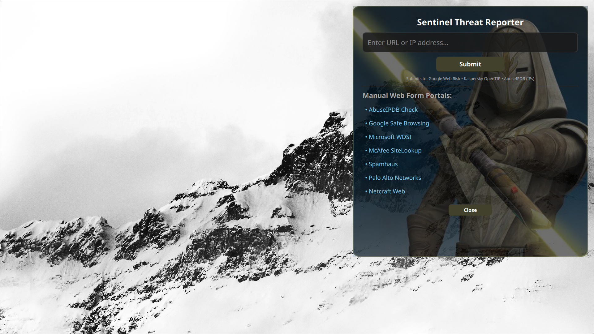

# Sentinel Threat Reporter



**Sentinel Threat Reporter** is a desktop On-Screen Display (OSD) and threat intelligence dispatch widget built with [Quickshell](https://outfoxxed.me/quickshell/) and QML. Designed for Wayland compositors (such as Hyprland), it allows security analysts, sysadmins, and Linux enthusiasts to quickly report or query malicious URLs and IP addresses across multiple security APIs and manual web portals simultaneously.

---

## Features

- **Automated API Submissions:**
  - **Google Web Risk:** Submits suspicious URIs directly via the Google Web Risk Submission API.
  - **Kaspersky OpenTIP:** Automatically queries threat analysis for submitted IP addresses and URLs.
  - **AbuseIPDB:** Automatically dispatches abuse reports for valid IPv4 addresses.
- **Wayland Clipboard Integration:**
  - Fast paste capability using `wl-paste` (right-click anywhere in the input field to paste copied targets).
- **Manual Web Portal Shortcuts:**
  - Pre-configured dynamic links to popular manual report and lookup tools including Safe Browsing, Microsoft WDSI, Spamhaus, Netcraft, Palo Alto, Symantec, and Trend Micro.
- **Native Desktop Overlay:**
  - Built using Wayland Layer Shell protocol (`wlr-layer-shell`) with smooth animated panel transitions.

---

## API Configuration

To use the automated threat reporting features, you must supply your own API keys for **AbuseIPDB**, **Google Web Risk**, and **Kaspersky OpenTIP**.

### Adding Your API Keys

Open `SentinelReport.qml` in your editor and locate the `dispatchApis` function near the bottom of the file. Replace the placeholder strings with your personal API keys:


    function dispatchApis(target) {
        apiProcess.rawResponse = "";

        // Insert your API keys here:
        var abuseKey     = "YOUR_ABUSEIPDB_API_KEY_HERE";
        var googleKey    = "YOUR_GOOGLE_WEBRISK_KEY_HERE";
        var kasperskyKey = "YOUR_KASPERSKY_OPENTIP_KEY_HERE";

        var isIp = /^(?:[0-9]{1,3}\.){3}[0-9]{1,3}$/.test(target);
        

## Dependencies

Before running Sentinel Threat Reporter, ensure you have the following installed on your system:

- **Quickshell** (Compiled with Wayland support)
- **`curl`** (For handling HTTP requests to security APIs)
- **`wl-clipboard`** (Provides `wl-paste` for clipboard interactions)
- **`bash`** (For executing combined command pipelines)

On Arch-based distributions (e.g., Arch Linux, CachyOS), you can install the system utilities via `pacman`:

```bash
sudo pacman -S curl wl-clipboard bash
